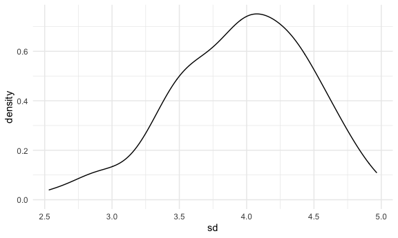

Simulations
================

## Let’s simulate something

I have a function.

``` r
sim_mean_sd = function(samp_size, mu = 3, sigma = 4) {
  
  sim_data = 
    tibble(
      x = rnorm(n = samp_size, mean = mu, sd = sigma)
    )

  sim_data %>% 
    summarize(
      mean = mean(x),
      sd = sd(x)
    )
  
}
```

I can “simulate” by running this line.

``` r
sim_mean_sd(30)
```

    ## # A tibble: 1 x 2
    ##    mean    sd
    ##   <dbl> <dbl>
    ## 1  3.28  2.87

## Let’s simulate a lot

Let’s start with a for loop.

``` r
output = vector("list", length = 100)

for (i in 1:100) {
  
  output[[i]] = sim_mean_sd(samp_size = 30)
  
}

bind_rows(output)
```

    ## # A tibble: 100 x 2
    ##     mean    sd
    ##    <dbl> <dbl>
    ##  1  3.67  3.73
    ##  2  3.07  3.23
    ##  3  3.38  3.72
    ##  4  3.01  4.03
    ##  5  3.27  3.97
    ##  6  3.06  3.93
    ##  7  2.86  3.40
    ##  8  2.02  3.57
    ##  9  3.75  3.06
    ## 10  1.99  3.76
    ## # … with 90 more rows

Let’s use a loop function.

``` r
sim_results = 
  rerun(100, sim_mean_sd(samp_size = 30)) %>% 
  bind_rows()
```

Let’s look at results…

``` r
sim_results %>% 
  ggplot(aes(x = mean)) + geom_density()
```


``` r
sim_results %>% 
  summarize(
    avg_samp_mean = mean(mean),
    sd_samp_mean = sd(mean)
  )
```

    ## # A tibble: 1 x 2
    ##   avg_samp_mean sd_samp_mean
    ##           <dbl>        <dbl>
    ## 1          3.03        0.773

``` r
sim_results %>% 
  ggplot(aes(x = sd)) + geom_density()
```


